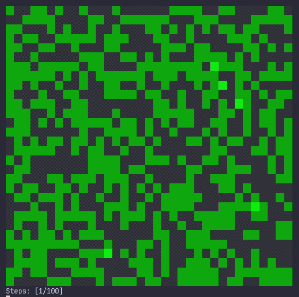

## Forest Fire Simulation inspired by Drossel-Schwabl Forest Fire Model

Code simulates a forest fire in a terminal window. It is based on model created in 1992 by Barbara Drossel and Frank Schwabl. Written in C for Linux operation systems.



Program consists of 3 files:

| File   | Description                            |
|--------|----------------------------------------|
| main.c | setup & loop                           |
| grid.h | constants & cell states & declarations |
| grid.c | cell colors & definitions              |

Optionally, we can begin the process by setting up our grid dimensions and other constants in the `grid.h` file.

| Constant    | Description                            |
|-------------|----------------------------------------|
| ROWS        | number of rows                         |
| COLS        | number of columns                      |
| STEPS       | number of steps                        |
| TIME        | time between the steps in milliseconds |
| TREE_CHANCE | chance for a tree to grow each step    |
| FIRE_CHANCE | chance for a fire to start each step   |

After that, we can build the program and watch the world burn.

### Build with gcc
```bash
gcc main.c grid.c -o forest-fire
./forest-fire
```

### Build with CMake
```bash
cmake -B build
cmake --build build
./build/forest-fire
```